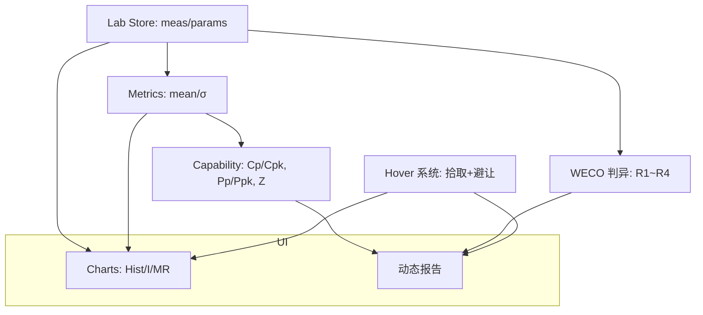
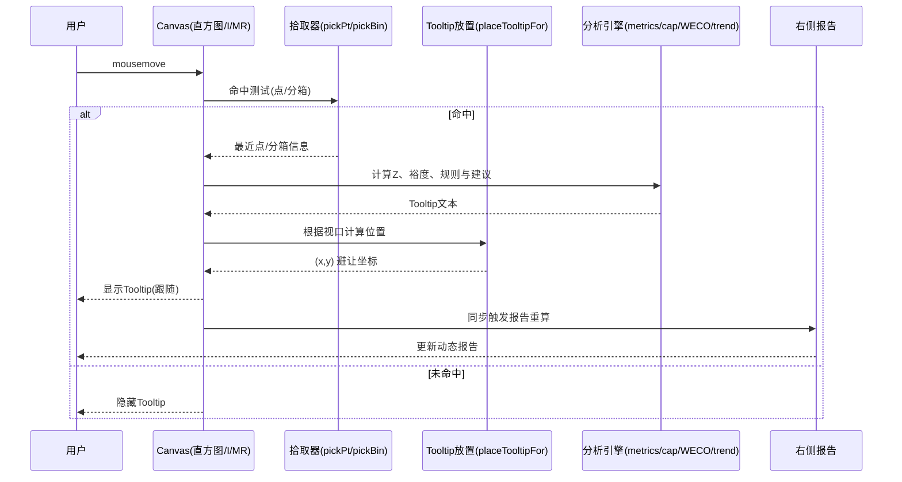
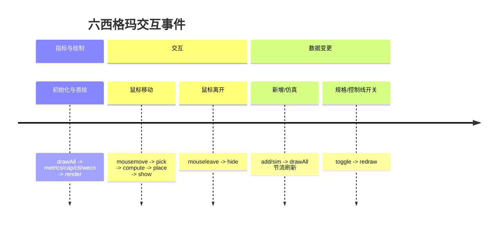
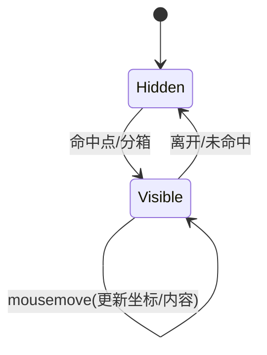

# 2025-08-26 工作总结（THQMS 前端）

> 本日聚焦“六西格玛 · 参数动态管理”页面的交互与可解释性增强：完成三栏信息架构、统一跟随且避让的 Tooltip 机制、直方图专业提示、实时动态分析报告，并保持导出能力可用。

## 今日交付摘要
- 三栏布局重构：左（参数选择+说明）、中（图表居中：直方图/I/MR）、右（动态六西格玛报告）。
- 统一 Tooltip 行为：基于窗口的 fixed 定位 + 边缘避让算法（自动翻转，留出 12px 间距）。
- 直方图 Tooltip：显示分箱区间、计数、占比、密度；I/MR Tooltip 保留值、规则、专业建议、时间等。
- 参数侧栏 Tooltip：规格、最近值与时间、中心偏移、距最近规格裕度。
- 动态六西格玛报告：规模、中心偏移与 Zμ、Cp/Cpk 与 Pp/Ppk（短/长期）、短期良率/PPM、稳定性（WECO 统计）、趋势（最近样本线性斜率）、规格裕度、行动建议。
- 导出：图片导出（三图）与 PDF 导出（指标+报告+图表）。

## 关键变更
- 视图：`src/views/SixSigma.vue`
  - 新增三栏布局与样式（panel/center/param list）。
  - 统一 Tooltip 放置与避让：placeTooltipFor()，应用于参数、直方图、I/MR。
  - 直方图分箱拾取与提示（bins 命中判定+统计文本）。
  - 报告生成：基于 metrics/cap/WECO/trend 计算的实时行文。
  - 保留并优化图片/PDF 导出，PDF包含右侧报告。

## 架构与数据流（概览）

## 序列图：鼠标悬停到报告更新

## 时序图：核心交互事件轴

## 状态图：Tooltip 可视状态

## 动态六西格玛报告（示例内容逻辑）
- 数据规模：n 与最近时间戳
- 中心偏移：Δ = mean - Target；Zμ = (mean - Target)/σ短期
- 能力：Cp/Cpk(短) 与 Pp/Ppk(长)
- 短期良率与 PPM：由 Zbench(短) 推导
- 稳定性：聚合 WECO 规则触发计数，生成结论（稳定/不稳定）
- 趋势：最近K点线性回归斜率，阈值基于 σ 确定“无明显/上升/下降”
- 规格裕度：min(|UCL-mean|, |mean-LCL|) 及折合 σ 距
- 建议：基于能力阈值、均值偏移与规则触发生成 SOP 级行动建议

## 质量与验证
- 类型检查：通过（SixSigma 改动）。
- 运行验证：鼠标在直方图/I/MR/参数列表 hover，Tooltip 跟随并靠边避让；右侧报告随数据、参数与交互实时更新。
- 导出：PNG 三图正常；PDF 包含指标、报告、三图并可打印。

## 后续建议
- Heatmap2D/3D 页面 Tooltip 同步采用该“跟随+避让”机制，保证体验一致。
- PDF 报告扩展：附加 WECO 触发明细表、直方图正态拟合曲线及关键 KPI 快照。
- 增加规则开关与说明：在 UI 中独立控制 R1~R4 判异参与与权重。
