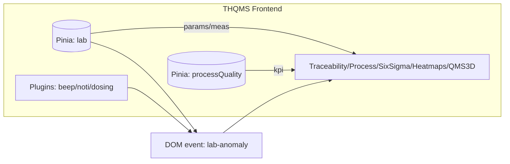
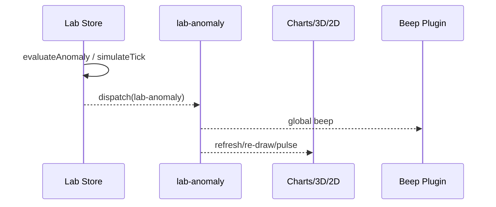
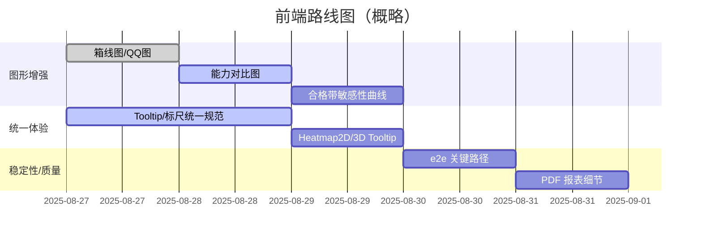

# 项目分析总结（THQMS 前端）

> 目标：提供 PCB 质量管理的实时可视化、联动仿真与六西格玛分析能力，提升发现-定位-处置的闭环效率。

## 一、系统概览
- 技术栈：Vue 3 + TypeScript + Vite，Pinia（状态），Vue Router（路由），Canvas（2D 图表），three.js（3D 可视化）。
- 关键页面：追溯看板、工序质量看板、QMS 3D、3D 热力图、2D 热力图、六西格玛。
- 交互总线：DOM 事件 `lab-anomaly` 联动全局声光、图表刷新、3D/2D 脉动。
- 数据来源：实验室测量（仿真/手工录入），过程 KPI；规格/控制限来自参数库。

## 二、架构与数据流


### 序列：异常到联动可视


### Store 结构（简化）
```mermaid
classDiagram
  class LabStore {
    +params: LabParam[]
    +meas: Record<paramId, {ts:number,value:number}[]>
    +anomalies: LabAnomaly[]
    +startSimulation(ms)
    +addMeasurement(item)
  }
  class ProcessQualityStore {
    +processes: Process[]
    +simulateTick(ms)
    +computeAggregates()
  }
```

## 三、模块职责
- TraceabilityDashboard：注入异常、实时联动、筛选持久化、判定文案与偏差可视。
- ProcessQualityDashboard：联动/不联动两模式（解耦），独立刷新间隔与持久化。
- Qms3D：六西格玛主题 3D 场景，异常脉动，品牌入口。
- Heatmap3D：参数×列网格，颜色映射与异常脉动。
- Heatmap2D：画布热力图（工序/参数筛选、标准/异常叠加、批量新增、专业解释 tooltip）。
- SixSigma：直方图、I/MR、WECO 判异、短/长期能力、导出 PNG/PDF、专业 tooltip；新增 SPC 分区与坐标标尺；三栏布局（参数/图表/报告）。

## 四、关键设计取舍
- 纯前端仿真：加速迭代与演示；数据面向后端接口可替换。
- Canvas 自绘：掌控绘制细节（WECO/SPC/标尺/tooltip），减少大型图表库依赖。
- DOM 事件总线：低耦合驱动跨页声光与刷新；足够轻量。
- 本地持久化：localStorage 保存用户偏好与节奏，提升体验。

## 五、专业图形与分析
- 已有：直方图、I 图、MR 图、SPC 分区、WECO 规则、动态六西格玛报告、3D/2D 热力图。
- 新增建议：
  1) 箱线图（Box Plot）：异常/偏态识别（Q1/Q3/IQR/须/异常点）。
  2) QQ 图：正态性检验可视化（便于判断能力指标适用性）。
  3) 短/长能力对比图：同轴展示 Cp/Cpk vs Pp/Ppk，直观区分控制内外差异。
  4) 合格带覆盖率曲线：均值与σ变化对良率的敏感性分析。

## 六、非功能特性
- 性能：
  - 绘制 O(n)；I/MR/Hist 每帧仅重绘当前页；SPC/标尺开销可控。
  - three.js 场景对象复用与释放，避免内存泄露。
- 可用性：
  - Tooltip 统一“跟随+边缘避让”；图表 tooltip 层级高于面板，避免遮挡。
  - 键盘聚焦样式和色彩对比考虑（可继续加强）。
- 安全与隐私：
  - 本地仿真数据仅存浏览器；无外发（可选对接后端时审查 CORS 与鉴权）。

## 七、风险与缓解
- 正态性假设不满足 → 增加 QQ 图与稳健统计（中位/ MAD），同时在报告中提示适用范围。
- 前端性能瓶颈 → 启用虚拟滚动/抽样绘制；动画节流；WebGL 可选加速。
- 多页联动复杂性 → 统一事件契约与工具函数；增加轻量 e2e 覆盖关键路径。

## 八、路线图（建议）


## 九、指标/KPI
- 交互性能：首次渲染 < 2s，交互响应 < 16ms（60fps）；
- 质量发现：WECO 异常捕捉率；
- 能力提升：Cpk≥1.33 的参数比例；
- 使用体验：关键操作 3 步内达成；
- 稳定性：前端错误率、崩溃率。

## 十、附录
- 路由：`/qms`、`/heatmap`、`/heatmap2d`、`/six-sigma`、追溯/工序质量看板等。
- 本地存储键：
  - Trace：`thqms.trace.*`（onlyIssue/realtime/labInterval/procInterval）
  - Process：`thqms.proc.*`（linked/interval）
  - Heatmap2D：`thqms.heat2d.*`（cols/refresh/showStd/showAno）
  - SixSigma：`thqms.six.*`（pid/bins/spec/ctl）
- 事件：`lab-anomaly`（异常联动/刷新/声光）
