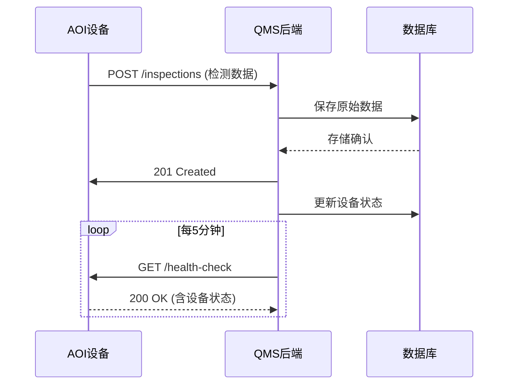
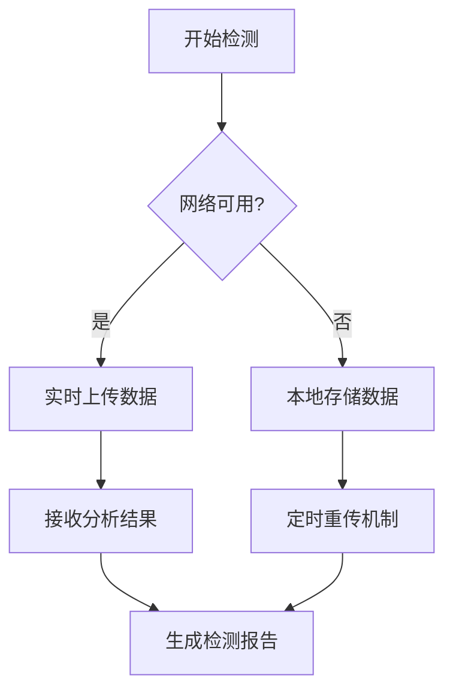
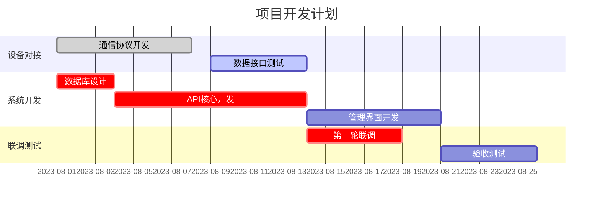
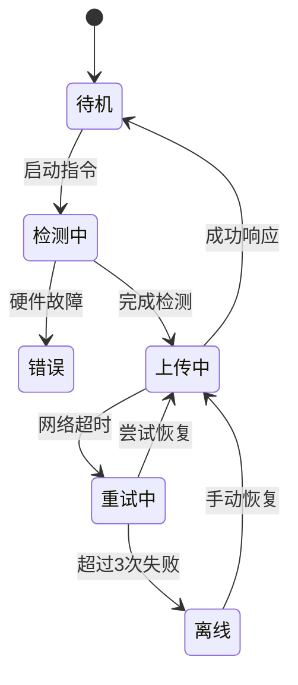

# PCB AOI-QMS 系统对接设计文档

## 1. 接口交互序列图


**交互说明**：
1. 设备通过POST提交检测数据
2. 系统返回HTTP 201确认接收
3. 定时健康检查维持连接

## 2. 检测流程时序图
```mermaid
timingDiagram
    title 单次检测耗时分析
    section AOI设备
    图像采集  : 0ms-150ms
    缺陷分析  : 160ms-450ms
    数据打包  : 460ms-500ms

    section QMS系统
    网络传输  : 510ms-600ms
    数据校验  : 610ms-700ms
    数据库写入: 710ms-900ms
```

**关键指标**：
- 设备端处理耗时 ≤500ms
- 服务端处理耗时 ≤400ms

## 3. 系统流程图


## 4. 功能模块图
```mermaid
componentDiagram
    component 设备层 {
        相机控制
        光学检测
        数据采集
    }
    
    component 服务层 {
        API网关
        任务调度
        缺陷分析
    }
    
    component 存储层 {
        检测原始数据
        分析结果
        设备日志
    }
    
    设备层 -- HTTP/HTTPS --> 服务层
    服务层 -- MongoDB --> 存储层
```

## 5. 项目甘特图


## 6. 设备状态图


## 文档使用说明
1. 所有图表均采用标准Mermaid语法
2. 支持以下平台直接渲染：
   - GitHub/GitLab/Gitee的Markdown预览
   - VS Code + Mermaid插件
   - 各类支持Mermaid的Wiki系统
3. 修改建议：
   ```mermaid
   flowchart LR
       A[原始图表] --> B{修改点}
       B -->|调整参数| C[更新时间数值]
       B -->|增加节点| D[补充状态分支]
   ```

> **提示**：将本文件保存为`pcb-aoi-qms-design.md`后，可用浏览器或Markdown编辑器查看可视化图表。
